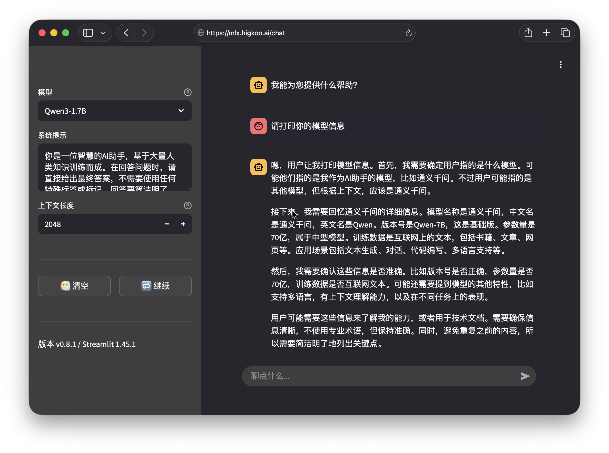

# MLX Chat

一个使用 Streamlit 为 MLX mlx-lm 开发的简单 UI / Web / 前端界面。



## 安装

```shell
$ ./install.sh
```

或者使用最新版本的库进行安装（可能会破坏功能）：

```shell
$ ./install.sh refresh
```

## 更新

获取更新版本后，建议再次运行安装脚本。

```shell
$ ./install.sh
```

## 运行

```shell
$ ./run.sh
```

您还可以使用自定义的 model.txt 文件（查看 [modelscope.cn](https://modelscope.cn) 获取更多模型）：

```shell
$ ./run.sh --port 2333 --address 192.168.1.100 --models models.txt
```
